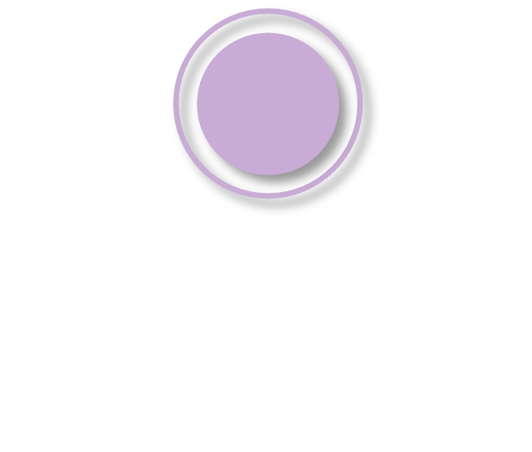
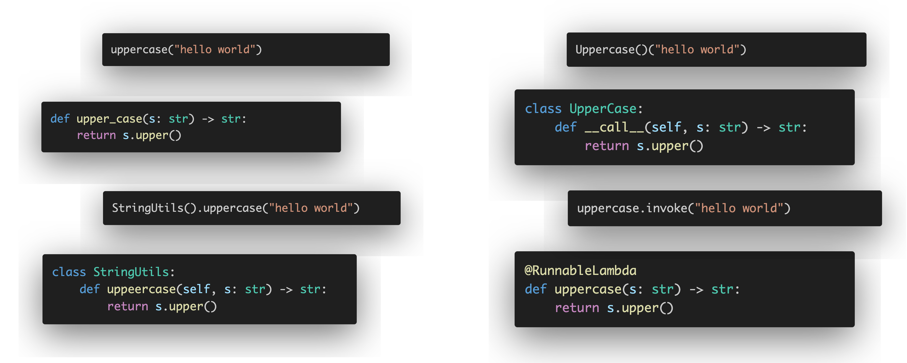

[[AI Agent]] [[LangGraph]] [[Node]] [[Python]]

#  LangGraph Node

## 1. Overview

  

      In LangGraph, nodes are a very important component. The official documentation already explains the basic usage of LangGraph, which is sufficient for fundamental agent development and usage. However, the greatest advantage of frameworks like Python and LangGraph is their <b>flexibility</b>—and at the same time, this is also their drawback. Being too flexible often results in a lack of structure when developing practical applications, which in turn leads to inefficiency in research and development. Therefore, it is necessary to have an in-depth discussion and reflection on the topic of nodes. 
      To have a deeper discussion on LangGraph Nodes, it is necessary to explore the following four topics in detail: 
      <ol>
        <li>What can serve as a node in LangGraph?</li>
        <li>What are the inputs and outputs of a node in LangGraph?</li>
        <li>What types of nodes exist in LangGraph?</li>
        <li>What characteristics do nodes in LangGraph have?</li>
      </ol>
  

  

    
  

## 2. Node Definition

节点本质上就是一段程序逻辑（Processing Logic）。

### 2.1 处理逻辑

在Python和LangChain的世界中，表达逻辑的方式有如下图所示：

这里要说明这一点的原因是，就和上面说的类似，我们在灵活性中慢慢地迷失了，慢慢混淆了很多概念，虽然他们能够正常工作，但是往往细微的区别影响到了程序能力的边界。

举例说明：

- `Callable[[Input], Output]`与`Runnable[Input, Output]`
- `Callable[[..], Output]`与`Callable[[...], Awaitable[Output]]`

为此，我准备了一张图表明这四种方法：

>  在这里再次强调下，在我们学习LangChain和LangGraph的时候或者其他框架，总之当你要完整地掌握一门技术用于生产环境时，一定要彻底明确其中的各项概念，千万不要稀里糊涂地使用，不然会欠下所谓的技术债。

### 2.2 节点类型定义

## 3. Node Inputs and Outputs

### 3.1 节点输入

### 3.2 节点输出

## 4. Node Types

## 5. Node Features

