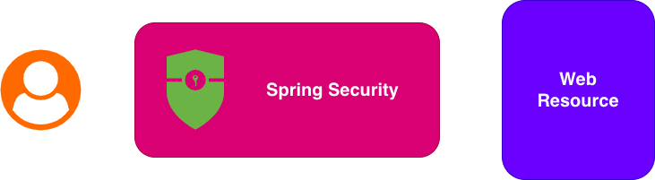
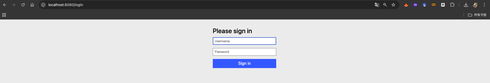

[[后端]] [[Spring Security]]

# Spring Security入门

## 一、简介Spring Security

Spring Security 是 Spring 生态中**最强大且广泛使用的安全框架**，主要用于为 Java/Spring 应用提供**认证（Authentication）和授权（Authorization）**能力。



---

**问题1：Spring Security在保护什么？**

Spring Security用户保护Web资源，所谓Web资源就是我们日常通过URL访问的数据。比如：

- `GET /index.html`静态资源
- `POST /login`接口数据
- 其他

---

## 二、环境搭建

在Spring Boot项目中引入Spring Security场景启动：

```
org.springframework.boot:spring-boot-starter-security
```

此时我们创建一个接口：

```kotlin
import org.springframework.web.bind.annotation.GetMapping
import org.springframework.web.bind.annotation.RestController

@RestController
class HelloController {

    @GetMapping("/hello")
    fun hello(): String {
        return "Hello World!"
    }

}
```

此时运行项目

```

  .   ____          _            __ _ _
 /\\ / ___'_ __ _ _(_)_ __  __ _ \ \ \ \
( ( )\___ | '_ | '_| | '_ \/ _` | \ \ \ \
 \\/  ___)| |_)| | | | | || (_| |  ) ) ) )
  '  |____| .__|_| |_|_| |_\__, | / / / /
 =========|_|==============|___/=/_/_/_/

 :: Spring Boot ::                (v3.5.7)

...
2025-10-25T19:53:47.569+08:00  WARN 8287 --- [spring-security-demo] [           main] .s.s.UserDetailsServiceAutoConfiguration : 

Using generated security password: efc8e53f-3d79-4a26-9bdf-2d6b154df758

This generated password is for development use only. Your security configuration must be updated before running your application in production.

2025-10-25T19:53:47.574+08:00  INFO 8287 --- [spring-security-demo] [           main] r$InitializeUserDetailsManagerConfigurer : Global AuthenticationManager configured with UserDetailsService bean with name inMemoryUserDetailsManager
2025-10-25T19:53:47.679+08:00  INFO 8287 --- [spring-security-demo] [           main] o.s.b.w.embedded.tomcat.TomcatWebServer  : Tomcat started on port 8080 (http) with context path '/'
2025-10-25T19:53:47.686+08:00  INFO 8287 --- [spring-security-demo] [           main] .m.d.s.a.SpringSecurityDemoApplicationKt : Started SpringSecurityDemoApplicationKt in 2.295 seconds (process running for 3.734)

```

此时控制台上会有一个随机生成的密码：`efc8e53f-3d79-4a26-9bdf-2d6b154df758`

此时访问`GET /hello`会发现跳转到登录页面：



输入用户名`user`和密码`efc8e53f-3d79-4a26-9bdf-2d6b154df758`后成功访问`hello`页面：


## 三、基本使用

Spring Security的核心是**认证**和**授权**，这里我们现在先了解如何基础配置修改认证和授权的行为。

### 3.1 修改用户名和密码

在`application.yml`中配置：

```yml
spring:
  security:
    user:
      name: USER
      password: ABC123456
```

再次启动，请求`GET /hello`后输入上述的用户名和密码后可以成功访问。

### 3.2 保护资源配置

创建一个配置类`SecurityConfig`（Kotlin语言）：

```kotlin
import org.springframework.context.annotation.Bean
import org.springframework.context.annotation.Configuration
import org.springframework.security.config.annotation.web.builders.HttpSecurity
import org.springframework.security.web.SecurityFilterChain

@Configuration
class SecurityConfig {

    @Bean
    fun securityFilterChain(http: HttpSecurity): SecurityFilterChain {
        http
            .authorizeHttpRequests {
                it
                    .requestMatchers("/hello").permitAll()
                    .anyRequest().authenticated()
            }
        .formLogin {
                it.permitAll()
            }
        return http.build()
    }

}
```

上述配置解释：

1. `http.authorizeHttpRequests`表示配置授权信息，即哪些资源需要保护、如何保护等；
2. `.requestMatchers("/hello").permitAll()`表示`/hello`接口现在允许所有人访问
3. `.anyRequest().authenticated()`表示其他所有的接口都被保护，需要认证
4. 配置`formLogin`表示表单登录，即我们看到的那个登录页面，如果不写该配置，则不会跳转到任何跳转

