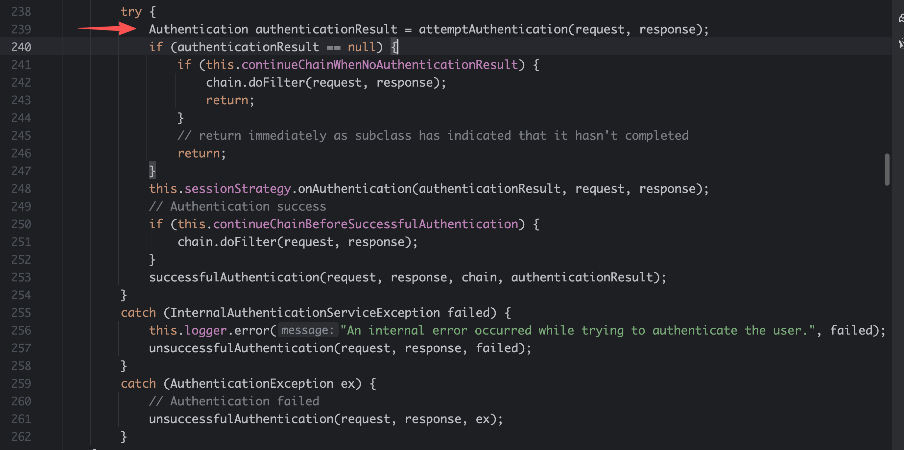
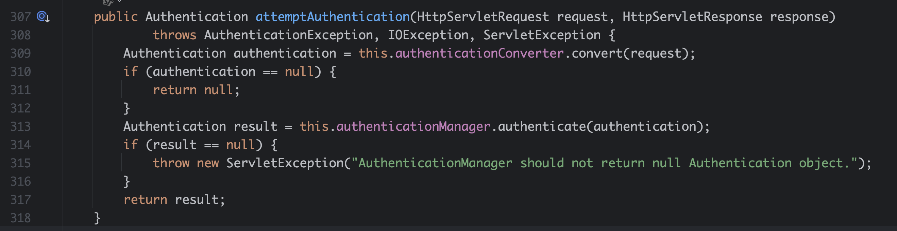
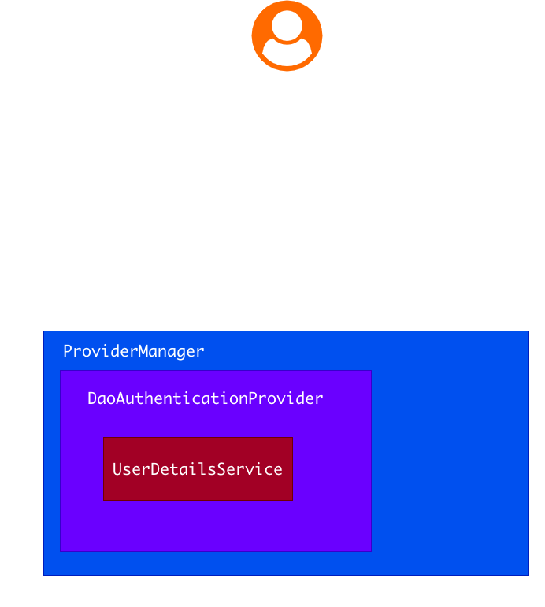

[[后端]] [[Spring Security]] [[Java]]

# Spring Security认证原理

## 一、认证（Authentication）

认证（Authentication）是一种鉴别身份的过程。例如你出示了中华人民共和国居民身份证给警察，警察通过人脸照片和其他手段比如公安信息系统来判断你这个人是谁，这个过程就是认证过程。当然中华人民共和国居民身份证是一种方式，军官证、护照等也是一些常用的认证手段，这只是一个感性认识，在具体的计算机Web系统中还不太一样。

回到Web应用，Spring Security采用的是**过滤器链（FilterChain）**实现的。首先大概简述下认证的一个流程：

1. 用户发起认证请求：比如用户名密码发起`POST /login`请求
2. 在Spring Security中的`SecurityFilterChain`中有一个`UsernamePasswordAuthenticationFilter`过滤器在看到这个请求后进行拦截
3. 获取请求中的用户名密码，拿系统的用户名密码表一对比，如果对了，就认证成功；如果错误就返回认证失败；
4. 认证成功后，Spring Security会颁发一个凭证，这个凭证中会保存这个用户的一系列信息，包括角色、权限等
5. 系统会将这个凭证信息进行加密、混淆等方式给用户返回一个令牌（Token）
6. 接下来在一段时间内，用户拿着系统办法的令牌就可以访问系统资源了

我们非常熟知的JWT就是以上的这个流程。

## 二、用户名密码认证流程详解

接下来要详细理解下`UsernamePasswordAuthenticationFilter`的流程，从中理解整个Spring Security的认证流程。

### 2.1 `UsernamePasswordAuthenticationFilter`是什么

面向对象确实臃肿繁琐，但是也诞生一个独具一格的源代码分析逻辑和方法，那就是**是什么**、**如何运行**和**运行时候是什么**几个问题。

`UsernamePasswordAuthenticationFilter`的声明如下：

```java
public class UsernamePasswordAuthenticationFilter extends AbstractAuthenticationProcessingFilter { ... }
```

显然这是一个`AbstractAuthenticationProcessingFilter`，这是一个非常重要的抽象类，在后续进一步的Spring Security的框架中会经常运用到。

1. 从名称看，`UsernamePasswordAuthenticationFilter`是一个`Filter`，且用作认证的`Filter`，是通过用户名密码来认证的`Filter`。
2. `AbstractAuthenticationProcessingFilter`是抽象的认证处理类
3. 显然`AbstractAuthenticationProcessingFilter`是一个`GenericFilterBean`，这个`GenericFilterBean`里面通常会有两个方法：
   1. `doFilter(ServletRequest request, ServletResponse response)`
   2. `doFilter(HttpServletRequest request, HttpServletResponse response)`

### 2.2 `AbstractAuthenticationProcessingFilter`如何运作

核心代码如下：



关注两个方面：

1. `attemptAuthentication`方法用于认证
2. 成功认证和失败认证后的处理逻辑，即`successfulAuthentication`和`unsuccessfulAuthentication`



首先，这个方法的返回值是一个`Authentication`，什么是`Authentication`是一个非常重要的问题。

`Authentication`就是一个凭证，我们平时经常听说过JWT，即Json Web Token，这个就是一种`Authentication`。`Authentication`中通常会保存如下内容：

1. 主体（Principal，注意拼写，不要写成Principle），用户就是主体，当然主体不一定是人，比如一个微服务，一个软件或者硬件客户端都是主体，不要认为主体一定是人。
2. 权限（Authority），Spring Security中提供了`GrantedAuthority`接口，我们会经常看到`? extends GrantedAuthority`泛型协变，在RABC或者权限管理系统中，有角色和权限的区分，在Spring Security这两者都是该接口的实现接口，只是名字上是否以`ROLE_`开头来表明是否为角色或者权限
3. 秘密凭证（Credential），密码就是Credential，第三方登录的Token也是Credential等，他是一个任意的`Object`
4. 是否已认证（Authenticated）有了凭证不一定你是合法通过的，只有`isAuthenticated=true`才是合法的凭证，可以访问资源

`Authentication`的实现类通常是`XxxAuthenticationToken`，如果你要自定义一种认证方式，比方式微信第三方登录，那么你必须先要定一个`Authentication`。

了解完`Authentication`后，`attemptAuthentication`中有两个方法被调用`this.authenticationConverter.convert`和`this.authenticationManager.authenticate`，这两个方法都是试图获取`Authentication`，也试图将`Authentication`中的`isAuthenticated`变为`true`。

`attemptAuthentication`这个方法通常是要重写的

#### 2.2.1 `AuthenticationConverter`接口

认证转换器是从请求中提取`Authentication`凭证

#### 2.2.2 `AuthenticationManager`接口

`AuthenticationManager`是对凭证进行认证（校验等操作）

### 2.3 `UsernamePasswordAuthenticationFilter`认证流程

源代码如下：

```java
@Override
public Authentication attemptAuthentication(HttpServletRequest request, HttpServletResponse response)
        throws AuthenticationException {
    // 第一个环节：这是不是一个认证请求，比如你发送 GET /login就不行
    if (this.postOnly && !request.getMethod().equals("POST")) {
        throw new AuthenticationServiceException("Authentication method not supported: " + request.getMethod());
    }
    // 第二环节：获取请求中的信息用户名/密码等
    String username = obtainUsername(request);
    username = (username != null) ? username.trim() : "";
    String password = obtainPassword(request);
    password = (password != null) ? password : "";
    // 第三环节：构建凭证
    UsernamePasswordAuthenticationToken authRequest = UsernamePasswordAuthenticationToken.unauthenticated(username,
            password);
    // Allow subclasses to set the "details" property
    setDetails(request, authRequest);
    // 第四环节：认证
    return this.getAuthenticationManager().authenticate(authRequest);
}
```

认证的流程细节如下：

1. 核实当前请求是不是要认证，请求方法、请求路径等
2. 将请求转换为`Authentication`，这个就是`AuthenticationConverter`干的事情，在`UsernamePasswordAuthenticationFilter`中是直接`new`出来的，如果这个过程比较复杂的话，例如要访问第三方的接口等需要独立开发一个`AuthenticationConverter`
3. 认证，通过`AuthenticationManager`进行实际认证，比如查询数据库比对用户名和密码等信息

### 2.4 调试用户名密码登录流程

我们就是要知道`AuthenticationManager`是如何运行，由于都是接口，无法知道如何实现的具体流程。

经过调试：

1. `UsernamePasswordAuthenticationFilter`中使用的是`ProviderManager`认证管理器

2. Java套娃呀，`ProviderManager`还不是最终的逻辑，其中又来了个新的接口`AuthenticationProvider`，它里面两个方法

   1. 是否支持
   2. 具体逻辑

   `UsernamePasswordAuthenticationFilter`中没有核实的`AuthenticationProvider`，接下来会进入到`this.parent`，也就是说**`AuthenticationManager`是多层级的**。这些设计实际上在很多场景中显得非常臃肿冗余，但也确实做到了通用性，因此，作为框架来说它是合格的，但是我们具体业务中应当不需要这样繁琐的设计。实话实说，Spring体系中的命名和设计确实无懈可击，细想起来都很有道理。

3. 通过进一步调试，我们发现最终调用的一个`AuthenticationProvider`是`DaoAuthenticationProvider`继承自`AbstractUserDetailsAuthenticationProvider`，核心在于它是`UserDetails`的`AuthenticationProvider`，根据抽象思维，提供用户详细信息的方式就多了去了，比如可以从内存中获取，从数据库中获取等，因此`Dao`方式也就是数据获取方式。`AbstractUserDetailsAuthenticationProvider`主要需要实现的就是如何获取`UserDetails`，这里又新增了很多概念：

   1. `UserDetails`：你可以认为就是用户信息，当然它是一个接口，你可以自己定义用户应该包含哪些信息，比如要有邮箱、手机号等，它需要有必须包含的内容，比如用户名、密码、是否激活、是否锁定、是否过期、权限或角色等。通常可以建立一个实体类将这些内容定义好以后存储到数据库中。
   2. `UserDetailsService`：这也是一个接口，只要实现一个方法就是如何根据用户名获取用户的信息`UserDetails`，所以你可以自己写一个方法去数据库或者通过其他方式获取具体的用户信息。我们在Spring Security项目启动的时候会提供一个默认的`UserDetailsService`实现，叫做`InMemoryUserDetailsManager`，他就是将用户名和密码存储在一个内存的`HashMap<String, MutableUserDetails>`中，这些都是默认实现，如果你的系统用户不多，而且要求固定，这就非常好了。
   3. `PasswordEncoder`：密码编码器，就是给密码进行加密使用的，作为安全常识，我们不可能将密码明文存储到数据库中，而是需要通过一些算法进行加密。该接口提供加密和匹配两个方法，当你存储密码的时候（注册）需要将密码加密，当你登录的时候需要匹配密码。这里要稍微展开说明下`PasswordEncoder`使用，通常我们使用`DelegatingPasswordEncoder`，密码在加密后的最前面通常会写明加密算法，比如`{bcrypt}xxx`。有一种比较特殊的`PasswordEncoder`叫做`NoOpPasswordEncoder`，即不进行加密的`PasswordEncoder`，目前已经被废弃，表示这是极其不安全的。
   4. `UserDetailsPasswordService`：该接口用户更新密码使用的。

   上述的概念和接口就是我们开发者需要提供的实现，然后通过配置`SecurityFilterChain`进行配置上，基本上就可以使用一个自己定义的从数据库中查询的用户登录方案。详细的认证流程是：之前我们将请求转换为`UsernamePasswordAuthenticationToken`了，我们从该Token中获取用户名和密码，然后先从缓存中试图获取该用户信息，如果获取不到我们调用`retrieveUser(username, authentication)`从提供的`UserDetailsService`中获取，最终判断是否认证成功。

### 2.5 总结



