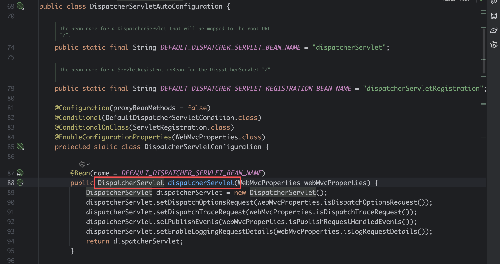
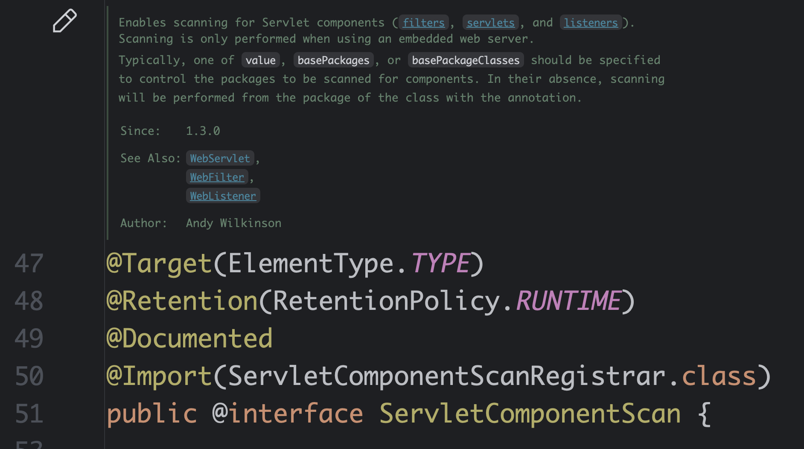
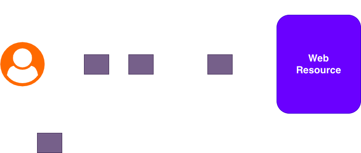

[[Spring]] [[Java Web]] [[Filter]] [[后端]]
# Spring中的`Filter`组件

## 一、简介

Spring Security的核心就是`Filter`，而且是Java Web中的`Filter`，因此需要稍微了解下这些古老的东西。

Java Web中有三大组件：

- `Servlet`
- `Filter`
- `Listener`

由于时代的变迁，这三样组件现在越来越不被重视和考察了。这里仅仅简要叙述下这三个组件的功能：

- `Servlet`是一个接口，里面会有一个`service`方法来实现，为了进一步适用于HTTP环境，衍生出了`HttpServlet`，那么`service`方法变成`doGet`，`doPost`等，这些都是上古的话题了。

  但是有个话题虽然远古，但是还要说说，就是Spring MVC的一个实现逻辑原理。Spring MVC中的核心使用的是`Servlet`组件，也就是`DispatchServlet`，具体参考`DispatcherServletAutoConfiguration`：

  

  顺便再一句，在Spring MVC中会有两个Spring容器，也就是父子容器，一个管理业务Bean，一个是管理Web组件的。

- `Filter`是当某个请求匹配后，在请求前和响应后进行执行处理逻辑的组件，是被Spring Security使用的核心组件

- `Listener`会对容器的启动、会话的变化行为等进行监听

## 二、如何注册Java Web三大组件（以`Filter`示例）

### 2.1 `@ServletComponentScan`

在Spring Boot中，`XxxxScan`是一系列的注解，比如`@ComponentScan`、`@EntityScan`和`@ConfigurationPropertiesScan`等，这里有一个`@ServletComponentScan`，如下图，在注释中说了很清楚了，用来扫描注册`Servlet`、`Filter`和`Listener`三大组件。



当然，我们没有了`web.xml`（如果你不知道什么，就当我什么都没说），可以通过Jakarta Servlet Specification中的一些注解来完成，注意这是Jakarta Servlet Specification中定义的注解，不是Spring提供的：

- `@WebServlet`
- `@WebFilter`
- `@WebListener`

### 2.2 `XxxRegistrationBean`

我们在Spring的容器中放入一个`XxxRegistrationBean`，这个Bean会注册一个组件到Web容器中。在上一节中，我们介绍了Jakarta Servlet Specification中有三个组件来定义三大组件，此外，还有一种编程的方式来注册三大组件。通常使用的是`XxxRegisteration.Dynamic`来构造和注册三大组件的。

这一点在Spring Security的源代码中就是这么使用的。

## 三、`Filter`组件

`Filter`接口：

```java
public interface Filter {

	default void init(FilterConfig filterConfig) throws ServletException {}
    void doFilter(ServletRequest request, ServletResponse response, FilterChain chain) throws IOException, ServletException;
    default void destroy() {
    }
}

```

这里最终的方法就是`doFilter`，还有个比较重要的类就是`FilterChain`。那么怎么运作呢？



一个`Filter`在执行的过程中，通过调用

```java
filterChain.doFilter(request, response)
```

走到下一个`Filter`，一直到最终的资源。如果你没有调用，那么请求在此时就结束了，你可以在此写入`HttpServletResponse`中给用户返回。

假设有个用户名密码的`Filter`，叫做`UsernamePasswordAuthenticationFilter`，这个过滤器当拦截到指定请求`POST /login`时候，会验证用户名密码是否合法，如果此时不合法的话，直接往响应了写一个`401`即可。

## 四、`GenericFilterBean`组件

Spring框架提供了一个通用的`Filter`Bean组件，叫做`GenericFilterBean`：

```java
public abstract class GenericFilterBean implements Filter, BeanNameAware, EnvironmentAware,
		EnvironmentCapable, ServletContextAware, InitializingBean, DisposableBean { ... }
```

- 首先`GenericFilterBean`是Java Web中的`Filter`
- `GenericFilterBean`还是一个Spring的Bean

顺带提一句其他接口的功能：

- `XxxAware`是一类Spring的IoC机制，比如`BeanNameAware`可以获取到Bean Name，`EnvironmentAware`和注入环境，`ServletContextAware`就可以注入Tomcat之类的容器对象，其他的，比如`ApplicationContextAware`可以获取到Spring容器等等
- `InitializingBean`和`DisposableBean`是用于控制Bean生命周期的接口，这个话题比较复杂，有**Spring**和**JSR250**两类方式控制，这里不展开讨论。
